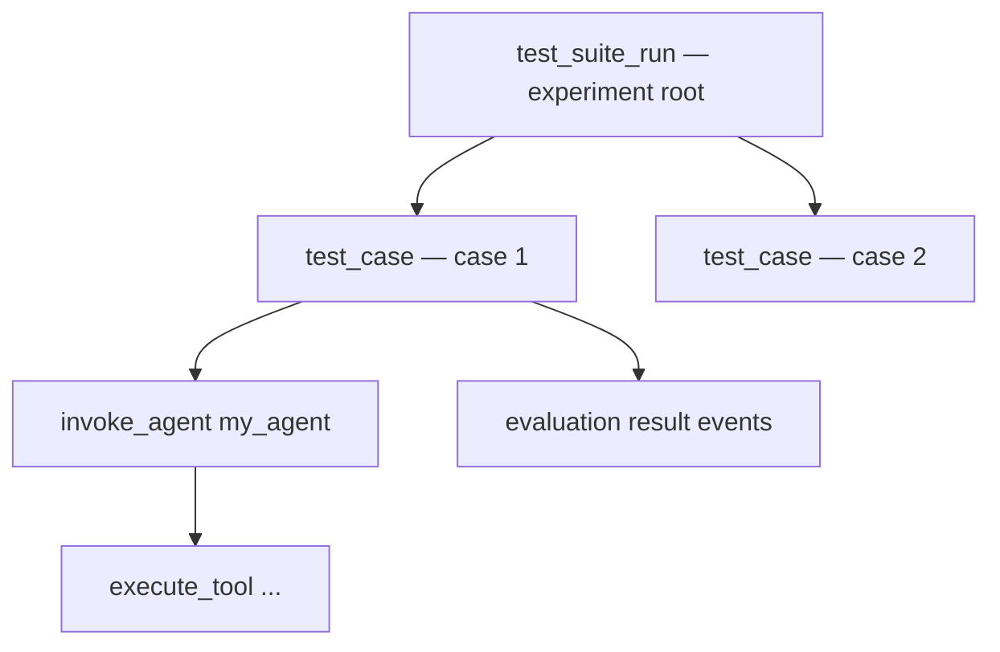

import { Aside } from '@astrojs/starlight/components';

The Python SDK provides three evaluation capabilities that all emit data through the standard OTLP pipeline:

- **`score()`** — attach quality scores to individual traces or spans
- **`evaluate()`** — run an agent against a dataset with automated scorer functions
- **`Experiment`** — upload pre-computed results from any evaluation framework

All evaluation data lands in the same OpenSearch index as your traces, so you can query scores alongside agent spans.

---

## `score()` — attach scores to traces

Submits an evaluation score as an OTEL span linked to the trace being scored.

```python
from opensearch_genai_observability_sdk_py import score

# Score an entire trace
score(
    name="relevance",
    value=0.92,
    trace_id="abc123def456...",
    explanation="Response addresses the user's query",
)

# Score a specific span
score(
    name="accuracy",
    value=0.95,
    trace_id="abc123def456...",
    span_id="789abc...",
    label="pass",
)

# Standalone score (no trace link)
score(name="baseline", value=0.75, label="acceptable")
```

### Parameters

| Parameter | Type | Description |
|---|---|---|
| `name` | `str` | Metric name, e.g. `"relevance"`, `"factuality"`. |
| `value` | `float` | Numeric score. |
| `trace_id` | `str` | Hex trace ID of the trace being scored. |
| `span_id` | `str` | Hex span ID for span-level scoring. Omit to score the whole trace. |
| `label` | `str` | Human-readable label, e.g. `"pass"`, `"relevant"`. |
| `explanation` | `str` | Evaluator rationale. Truncated to 500 characters. |
| `response_id` | `str` | LLM completion ID for correlation. |
| `attributes` | `dict` | Additional span attributes. |

### Getting the trace ID

```python
from opentelemetry import trace
from opensearch_genai_observability_sdk_py import observe, Op

@observe(op=Op.INVOKE_AGENT, name="my_agent")
def run(query: str) -> str:
    ctx = trace.get_current_span().get_span_context()
    trace_id = format(ctx.trace_id, "032x")
    # ... agent logic ...
    return result
```

---

## `evaluate()` — run experiments

Executes a task function against each item in a dataset, runs scorer functions, and records everything as OTel experiment spans.

```python
from opensearch_genai_observability_sdk_py import register, observe, evaluate, Op, Score

register(service_name="my-eval")

@observe(op=Op.INVOKE_AGENT, name="my_agent")
def my_agent(input: str) -> str:
    return f"Answer to: {input}"

def relevance_scorer(input, output, expected) -> Score:
    is_relevant = expected.lower() in output.lower()
    return Score(
        name="relevance",
        value=1.0 if is_relevant else 0.0,
        label="relevant" if is_relevant else "irrelevant",
    )

result = evaluate(
    name="my_agent_v1_eval",
    task=my_agent,
    data=[
        {"input": "What is Python?", "expected": "programming language"},
        {"input": "What is OpenSearch?", "expected": "search engine"},
    ],
    scores=[relevance_scorer],
    metadata={"agent_version": "v1"},
)

print(result.summary)
```

### Parameters

| Parameter | Type | Description |
|---|---|---|
| `name` | `str` | Experiment name. |
| `task` | `Callable` | Function that takes input and returns output. Use `@observe` for full tracing. |
| `data` | `list[dict]` | Test cases: `"input"` (required), `"expected"`, `"case_id"`, `"case_name"` (optional). |
| `scores` | `list[Callable]` | Scorer functions — each receives `(input, output, expected)`. |
| `metadata` | `dict` | Attached to the root experiment span. |
| `record_io` | `bool` | Record input/output/expected as span attributes. Default `False`. |

### Scorer functions

Scorers return one of:

```python
# Full Score object
def accuracy(input, output, expected) -> Score:
    return Score(name="accuracy", value=0.95, label="pass", explanation="Correct")

# Multiple scores
def multi(input, output, expected) -> list[Score]:
    return [Score(name="relevance", value=0.9), Score(name="coherence", value=0.85)]

# Simple float (function name becomes metric name)
def brevity(input, output, expected) -> float:
    return min(1.0, 100 / max(len(output), 1))
```

### `Score` dataclass

```python
@dataclass
class Score:
    name: str                       # Metric name
    value: float                    # Numeric score
    label: str | None = None        # Human-readable label
    explanation: str | None = None  # Rationale
    metadata: dict | None = None    # Extra metadata
```

### OTel span structure



Agent traces from the task become children of `test_case` spans — full waterfall from experiment to individual LLM calls.

### Result types

```python
result = evaluate(...)
result.summary          # ExperimentSummary
result.summary.scores   # dict[str, ScoreSummary] — avg, min, max, count per metric
result.cases            # list[CaseResult] — per-case input, output, scores, status
```

---

## `Experiment` — upload pre-computed results

Use `Experiment` when you already have evaluation results from another framework (RAGAS, DeepEval, pytest, custom) and want to upload them as OTel spans.

```python
from opensearch_genai_observability_sdk_py import register, Experiment

register(service_name="eval-upload")

with Experiment("ragas_eval_v2", metadata={"framework": "ragas"}) as exp:
    exp.log(
        input="What is OpenSearch?",
        output="OpenSearch is an open-source search engine.",
        expected="search and analytics engine",
        scores={"faithfulness": 0.92, "relevance": 0.88},
        case_name="opensearch_definition",
    )
    exp.log(
        input="How does RAG work?",
        output="RAG retrieves documents then generates answers.",
        scores={"faithfulness": 0.95, "relevance": 0.91},
        case_name="rag_explanation",
    )
# summary printed on close
```

### `log()` parameters

| Parameter | Type | Description |
|---|---|---|
| `input` | any | Test case input. |
| `output` | any | Agent output. |
| `expected` | any | Ground truth. |
| `scores` | `dict[str, float]` | Pre-computed scores. |
| `metadata` | `dict` | Per-case metadata. |
| `error` | `str` | Error message (sets status to `"fail"`). |
| `case_id` | `str` | Explicit ID. Defaults to SHA256 of input. |
| `case_name` | `str` | Human-readable name. |
| `trace_id` | `str` | Creates OTel span link to an agent trace. |
| `span_id` | `str` | Span-level linking (with `trace_id`). |

### A/B comparison

Run the same dataset against different agent versions:

```python
result_a = evaluate(name="comparison", task=agent_v1, data=cases, scores=[accuracy],
                    metadata={"version": "v1"})
result_b = evaluate(name="comparison", task=agent_v2, data=cases, scores=[accuracy],
                    metadata={"version": "v2"})

print(f"V1: {result_a.summary.scores['accuracy'].avg:.2f}")
print(f"V2: {result_b.summary.scores['accuracy'].avg:.2f}")
```

---

## `OpenSearchTraceRetriever` — query stored traces

Retrieves traces from OpenSearch for building evaluation pipelines. Requires the `[opensearch]` extra:

```bash
pip install "opensearch-genai-observability-sdk-py[opensearch]"
```

```python
from opensearch_genai_observability_sdk_py import OpenSearchTraceRetriever

retriever = OpenSearchTraceRetriever(
    host="https://localhost:9200",
    auth=("admin", "admin"),
    verify_certs=False,
)
```

### Methods

**`list_root_spans()`** — find recent agent traces:

```python
roots = retriever.list_root_spans(services=["my-agent"], max_results=20)
```

**`find_evaluated_trace_ids()`** — filter out already-scored traces:

```python
evaluated = retriever.find_evaluated_trace_ids([s.trace_id for s in roots])
to_score = [s for s in roots if s.trace_id not in evaluated]
```

**`get_traces()`** — fetch full trace with all spans:

```python
session = retriever.get_traces(roots[0].trace_id)
for trace in session.traces:
    for span in trace.spans:
        print(f"  {span.name} | {span.operation_name} | tokens: {span.input_tokens}")
```

### Complete evaluation pipeline

```python
from opensearch_genai_observability_sdk_py import register, score, OpenSearchTraceRetriever

register(service_name="eval-pipeline")
retriever = OpenSearchTraceRetriever(host="https://localhost:9200",
                                     auth=("admin", "admin"), verify_certs=False)

# Find un-evaluated traces → score them
roots = retriever.list_root_spans(services=["my-agent"])
evaluated = retriever.find_evaluated_trace_ids([s.trace_id for s in roots])

for root in roots:
    if root.trace_id not in evaluated:
        session = retriever.get_traces(root.trace_id)
        relevance = compute_relevance(session.traces[0].spans)
        score(name="relevance", value=relevance, trace_id=root.trace_id)
```

### AWS authentication

```python
from opensearchpy import RequestsAWSV4SignerAuth
import boto3

auth = RequestsAWSV4SignerAuth(boto3.Session().get_credentials(), "us-east-1", "es")
retriever = OpenSearchTraceRetriever(
    host="https://search-my-domain.us-east-1.es.amazonaws.com", auth=auth,
)
```

---

## Related links

- [Python SDK reference](/docs/send-data/ai-agents/python/) — `register`, `observe`, `enrich` documentation
- [Agent Tracing UI](/docs/ai-observability/agent-tracing/) — explore traces in OpenSearch Dashboards
- [Agent Health — Experiments](/docs/agent-health/evaluations/experiments/) — UI and CLI-based experiment workflows
