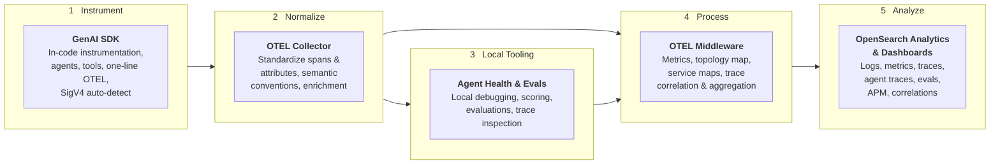

The OpenSearch Observability Stack is built on open standards with OpenTelemetry at its core. Every component is open-source and runs in Docker containers on your machine.

## End-to-End Platform

From code to insight — the platform covers the full AI observability lifecycle:

## Architecture

## Data flow

1. **Instrument**: Your applications emit traces, logs, and metrics using the [GenAI SDK](/docs/send-data/ai-agents/python/) or standard OpenTelemetry instrumentation.
2. **Normalize**: The OTel Collector batches, processes, and standardizes telemetry using semantic conventions.
3. **Local Tooling**: [Agent Health](/docs/agent-health/) provides local debugging, evaluation scoring, and trace inspection during development.
4. **Process**: Data Prepper ingests trace data, builds service maps, and computes RED metrics (request rate, error rate, duration).
5. **Analyze**: OpenSearch indexes traces, logs, and evaluation results. Prometheus stores time-series metrics. OpenSearch Dashboards provides trace exploration, agent trace views, PromQL-based metric charts, and service maps.

## Key design decisions

- **OpenTelemetry-native**: All data ingestion uses OTel protocols and semantic conventions. No proprietary agents.
- **GenAI semantic conventions**: AI agent traces use the standard `gen_ai.*` OTel attributes, enabling interoperability with any OTel-compatible tool.
- **PPL and PromQL**: Query traces and logs with PPL (Piped Processing Language) and metrics with PromQL.
- **Local-first**: The entire stack runs on your machine via Docker Compose. No cloud account or external dependencies required.
