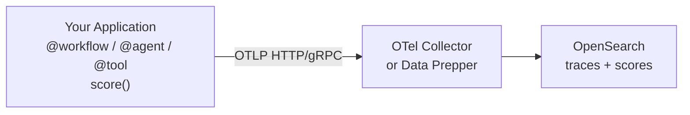

The OpenSearch AI Observability SDKs instrument LLM applications using standard OpenTelemetry. They handle the gap that general-purpose OTel doesn't cover: tracing your own agent logic — the workflows, agents, and tools that sit above raw LLM calls — and submitting evaluation scores back through the same pipeline.

The SDKs are thin wrappers. They do not replace OpenTelemetry, they configure it. Remove a decorator and your code still works unchanged.

## What the SDK covers

**Pipeline setup** — one call (`register()`) creates a `TracerProvider`, wires up an OTLP exporter, and activates auto-instrumentation for any installed LLM library instrumentors (OpenAI, Anthropic, Bedrock, LangChain, and more).

**Application tracing** — decorators (Python) or wrapper functions (JavaScript) that produce OTEL spans with [GenAI semantic convention](https://opentelemetry.io/docs/specs/semconv/gen-ai/) attributes for four span types:

| Type | Use for |
|---|---|
| `workflow` | Top-level orchestration — the entry point of a pipeline run |
| `task` | A discrete unit of work inside a workflow |
| `agent` | Autonomous decision-making logic that calls tools or LLMs |
| `tool` | A function invoked by an agent |

**Evaluation scoring** — `score()` emits evaluation metrics as OTEL spans at span, trace, or session level. No separate client or index needed — scores travel through the same OTLP pipeline as traces.

**AWS support** — built-in SigV4 signing for OpenSearch Ingestion (OSIS) and OpenSearch Service endpoints.

## Architecture

The SDK configures a `BatchSpanProcessor` that exports in the background — your application code is never blocked waiting on network I/O.

## Available SDKs

- [Python SDK](/opensearch-agentops-website/docs/sdks/python/) — `opensearch-genai-sdk-py` on PyPI
- [JavaScript / TypeScript SDK](/opensearch-agentops-website/docs/sdks/javascript/) — `opensearch-genai-sdk` on npm

## Related links

- [Agent Traces](/opensearch-agentops-website/docs/apm/agent-traces/) — viewing traces in OpenSearch Dashboards
- [Send Data](/opensearch-agentops-website/docs/send-data/) — OTLP pipeline setup and collector configuration
- [GenAI semantic conventions](https://opentelemetry.io/docs/specs/semconv/gen-ai/) — the OTel spec the SDKs follow
