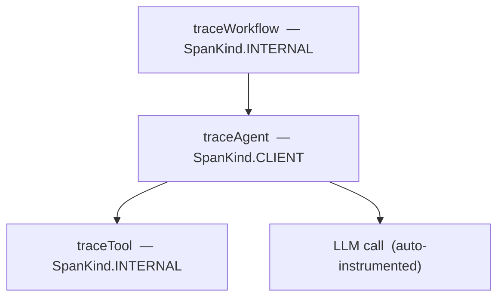

`opensearch-genai-sdk` instruments Node.js LLM applications using standard OpenTelemetry. It configures the OTEL pipeline in one call, provides wrapper functions for tracing your application logic, and emits evaluation scores through the same OTLP exporter.

- **npm:** `opensearch-genai-sdk`
- **Node.js:** 18+
- **TypeScript:** full type definitions included
- **Source:** [github.com/vamsimanohar/opensearch-genai-sdk-py](https://github.com/vamsimanohar/opensearch-genai-sdk-py)

## Installation

```bash
npm install opensearch-genai-sdk
```

For auto-instrumentation of LLM providers, install the relevant instrumentor packages:

```bash
npm install @traceloop/instrumentation-openai
npm install @traceloop/instrumentation-anthropic
npm install @traceloop/instrumentation-langchain
```

## Quick start

```typescript
import { register, traceWorkflow, traceAgent, traceTool, score } from "opensearch-genai-sdk";

register({ endpoint: "http://localhost:4318/v1/traces", projectName: "my-app" });

const getWeather = traceTool("get_weather", (city: string) => {
  return { city, temp: 22, condition: "sunny" };
}, { description: "Fetch current weather for a city" });

const assistant = traceAgent("weather_assistant", (query: string) => {
  const data = getWeather("Paris");
  return `${data.condition}, ${data.temp}C`;
});

const run = traceWorkflow("weather_pipeline", (query: string) => {
  return assistant(query);
});

const result = run("What's the weather?");
score({ name: "relevance", value: 0.95, traceId: "...", source: "llm-judge" });
```

---

## `register()`

Configures the OTEL tracing pipeline. Call once at startup before any tracing occurs.

```typescript
import { register } from "opensearch-genai-sdk";

register({
  endpoint: "http://localhost:4318/v1/traces",
  projectName: "my-app",
});
```

| Option | Type | Default | Description |
|---|---|---|---|
| `endpoint` | `string` | `http://localhost:21890/opentelemetry/v1/traces` | OTLP endpoint URL. Reads `OPENSEARCH_OTEL_ENDPOINT` if not set. |
| `projectName` | `string` | `"default"` | Attached to all spans as `service.name`. Reads `OTEL_SERVICE_NAME`. |
| `auth` | `string` | `"auto"` | `"auto"` detects AWS endpoints and enables SigV4. `"sigv4"` always signs. `"none"` never signs. |
| `batch` | `boolean` | `true` | `true` uses `BatchSpanProcessor` (production). `false` uses `SimpleSpanProcessor` (debugging). |
| `autoInstrument` | `boolean` | `true` | Discovers and activates installed OTel instrumentor packages. |
| `exporter` | `SpanExporter` | | Custom exporter. Overrides `endpoint` and `auth`. |

### Examples

Self-hosted:

```typescript
register({ projectName: "my-app" });
```

AWS OpenSearch Ingestion:

```typescript
register({
  endpoint: "https://pipeline.us-east-1.osis.amazonaws.com/v1/traces",
  projectName: "my-app",
  auth: "sigv4",
});
```

---

## Trace wrappers

Four higher-order functions trace application logic as OTEL spans with [GenAI semantic convention](https://opentelemetry.io/docs/specs/semconv/gen-ai/) attributes. All four support sync and async functions. Errors are recorded as span status `ERROR` with an exception event and re-thrown.

### Span hierarchy



### Common signature

```typescript
traceWorkflow(name, fn, options?)
traceTask(name, fn, options?)
traceAgent(name, fn, options?)
traceTool(name, fn, options?)
```

| Option | Type | Description |
|---|---|---|
| `version` | `number` | Stored as `gen_ai.agent.version` or `gen_ai.entity.version`. |
| `description` | `string` | Tool description stored as `gen_ai.tool.description`. (`traceTool` only) |

### `traceWorkflow`

Top-level orchestration. `gen_ai.operation.name = "workflow"`.

```typescript
const runPipeline = traceWorkflow("qa_pipeline", (query: string) => {
  const plan = planSteps(query);
  return execute(plan);
});
```

Span attributes: `gen_ai.operation.name`, `gen_ai.agent.name`, `gen_ai.entity.input`, `gen_ai.entity.output`.

### `traceTask`

A discrete unit of work. Same attributes and defaults as `traceWorkflow`.

```typescript
const planSteps = traceTask("plan_steps", (query: string) => {
  return llm.generate(`Plan steps for: ${query}`);
});
```

### `traceAgent`

Autonomous decision-making logic. Defaults to `SpanKind.CLIENT`. Span name is prefixed: `invoke_agent <name>`.

```typescript
const research = traceAgent("research_agent", async (query: string) => {
  const result = await searchTool(query);
  return summarize(result);
}, { version: 2 });
```

### `traceTool`

A function invoked by an agent. Span name is prefixed: `execute_tool <name>`.

```typescript
const search = traceTool("web_search", (query: string): string[] => {
  return searchApi.query(query);
}, { description: "Search the web for documents" });
```

Additional attributes: `gen_ai.tool.name`, `gen_ai.tool.type` (`"function"`), `gen_ai.tool.description`, `gen_ai.tool.call.arguments`, `gen_ai.tool.call.result`.

---

## `score()`

Submits an evaluation score as an OTEL span. Scores flow through the same OTLP pipeline as traces.

### Span-level scoring

```typescript
score({
  name: "accuracy",
  value: 0.95,
  traceId: "abc123",
  spanId: "def456",
  explanation: "Answer matches ground truth",
  source: "heuristic",
});
```

### Trace-level scoring

```typescript
score({
  name: "relevance",
  value: 0.92,
  traceId: "abc123",
  source: "llm-judge",
});
```

### Session-level scoring

```typescript
score({
  name: "user_satisfaction",
  value: 0.88,
  conversationId: "session-123",
  label: "satisfied",
  source: "human",
});
```

### Parameters

| Parameter | Type | Description |
|---|---|---|
| `name` | `string` | Metric name, e.g. `"relevance"`, `"factuality"`. |
| `value` | `number` | Numeric score. |
| `traceId` | `string` | Trace being scored. |
| `spanId` | `string` | Span being scored (span-level). |
| `conversationId` | `string` | Session ID (session-level). |
| `label` | `string` | Human-readable label. |
| `explanation` | `string` | Evaluator rationale. Truncated to 500 characters. |
| `responseId` | `string` | LLM completion ID for correlation. |
| `source` | `string` | `"sdk"`, `"human"`, `"llm-judge"`, `"heuristic"`. |
| `metadata` | `Record<string, unknown>` | Arbitrary key-value metadata. |

---

## Auto-instrumentation

`register()` attempts to activate any installed OTel instrumentor packages. Install the package for your LLM provider and its calls are traced automatically.

| Provider | Package |
|---|---|
| OpenAI | `@traceloop/instrumentation-openai` |
| Anthropic | `@traceloop/instrumentation-anthropic` |
| LangChain | `@traceloop/instrumentation-langchain` |
| HTTP | `@opentelemetry/instrumentation-http` |
| Fetch | `@opentelemetry/instrumentation-fetch` |

To disable:

```typescript
register({ autoInstrument: false });
```

---

## Environment variables

| Variable | Description | Default |
|---|---|---|
| `OPENSEARCH_OTEL_ENDPOINT` | OTLP endpoint URL | `http://localhost:21890/opentelemetry/v1/traces` |
| `OTEL_SERVICE_NAME` | Service name for all spans | `"default"` |
| `OPENSEARCH_PROJECT` | Project name (fallback to `OTEL_SERVICE_NAME`) | `"default"` |

---

## Related links

- [Python SDK](/opensearch-agentops-website/docs/sdks/python/) — Python equivalent
- [Agent Traces](/opensearch-agentops-website/docs/apm/agent-traces/) — viewing traces in OpenSearch Dashboards
- [Send Data](/opensearch-agentops-website/docs/send-data/) — OTLP pipeline and collector setup
- [FAQ](/opensearch-agentops-website/docs/sdks/faq/) — common questions
- [npm](https://www.npmjs.com/package/opensearch-genai-sdk) — package page
