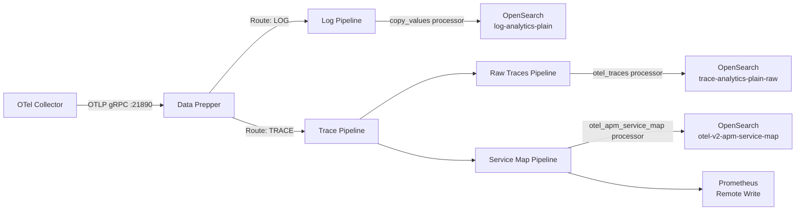

The data pipeline is the processing layer between your OpenTelemetry Collectors and OpenSearch. It handles routing, transformation, enrichment, and indexing of traces, logs, and metrics.

In the default stack configuration, **Data Prepper** serves as the primary pipeline engine. It receives OTLP data from collectors, routes events by signal type, applies processors, and writes to the appropriate OpenSearch indices.

## Architecture

## Pipeline components

| Component | Role | Default Port |
|-----------|------|-------------|
| **OTel Collector** | Collects, batches, and exports telemetry from applications | 4317 (gRPC), 4318 (HTTP) |
| **Data Prepper** | Routes, transforms, and indexes telemetry into OpenSearch | 21890 (OTLP source) |
| **OpenSearch** | Stores and indexes traces, logs, and metrics | 9200 (REST API) |
| **Prometheus** | Receives service map metrics via remote write | 9090 |

## When to customize pipelines

Customize the default pipeline configuration when you need to:

- **Add processors** -- Enrich, filter, or transform events before indexing (e.g., add Kubernetes metadata, redact PII, parse log formats).
- **Change routing** -- Send specific log sources to different indices or add conditional processing.
- **Adjust performance** -- Tune worker counts, batch sizes, and delays for your throughput requirements.
- **Add sinks** -- Export data to additional destinations beyond OpenSearch (e.g., S3, Kafka, Prometheus).
- **Bypass the pipeline** -- Use the OpenSearch Bulk API directly for pre-processed data or simple ingestion patterns.

## Pipeline subsections

<ul>
  <li><a href="/opensearch-agentops-website/docs/send-data/data-pipeline/data-prepper/">Data Prepper</a> -- Full pipeline configuration walkthrough including routing, processors, and sinks.</li>
  <li><a href="/opensearch-agentops-website/docs/send-data/data-pipeline/ingest-api/">Ingest API</a> -- Direct ingestion via the OpenSearch Bulk API for pre-processed data.</li>
  <li><a href="/opensearch-agentops-website/docs/send-data/data-pipeline/batching/">Batching &amp; Performance</a> -- Tune batch sizes, memory limits, and worker counts for production throughput.</li>
</ul>

## Related links

- [OpenTelemetry Collector](/opensearch-agentops-website/docs/send-data/opentelemetry/collector/) -- Configure the collector that feeds data into the pipeline.
- [Data Prepper documentation](https://opensearch.org/docs/latest/data-prepper/) -- Official Data Prepper reference.
