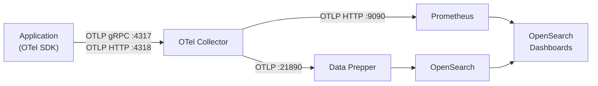

The OpenSearch Observability Stack ingests telemetry through a standards-based pipeline. Applications emit traces, metrics, and logs using OpenTelemetry, which are collected, processed, and routed to their respective storage backends.

This section covers every layer of the ingestion pipeline, from instrumenting your code to configuring the collectors and processors that deliver data to OpenSearch and Prometheus.

## Architecture

The following diagram shows the end-to-end data flow from your applications to the storage and query layer:



**Traces and logs** flow through the OTel Collector into Data Prepper, which processes and indexes them in OpenSearch. **Metrics** are forwarded from the OTel Collector to Prometheus via OTLP HTTP, where they are stored and queried by OpenSearch Dashboards.

## Supported Protocols

| Protocol | Port | Transport | Use Case |
|----------|------|-----------|----------|
| OTLP gRPC | 4317 | HTTP/2 + Protobuf | SDK default, highest throughput |
| OTLP HTTP | 4318 | HTTP/1.1 + Protobuf or JSON | Browser, serverless, firewall-restricted environments |

Both endpoints accept traces, metrics, and logs. CORS is enabled on the HTTP endpoint for browser-based instrumentation.

## Default Endpoints

| Component | Port | Protocol | Description |
|-----------|------|----------|-------------|
| OTel Collector (gRPC) | 4317 | OTLP gRPC | Primary telemetry ingestion |
| OTel Collector (HTTP) | 4318 | OTLP HTTP | HTTP telemetry ingestion |
| OTel Collector (metrics) | 8888 | Prometheus scrape | Collector self-monitoring |
| Data Prepper | 21890 | OTLP gRPC | Trace and log processing |
| Prometheus | 9090 | OTLP HTTP | Metrics storage |

## Sections

### [OpenTelemetry](/opensearch-agentops-website/docs/send-data/opentelemetry/)

Core instrumentation framework. Learn about the OTel Collector configuration, auto-instrumentation for zero-code setup, manual instrumentation for custom telemetry, and sampling strategies for controlling data volume.

### [Applications](/opensearch-agentops-website/docs/send-data/applications/)

Language-specific guides for instrumenting your services. Covers Python, Java, Node.js, Go, .NET, and browser applications, plus dedicated guidance for AI/LLM agent observability.

### [Data Pipeline](/opensearch-agentops-website/docs/send-data/pipeline/)

Configure the backend processing layer. Covers Data Prepper pipelines for trace and log processing, Prometheus for metrics storage, and index management in OpenSearch.

### [Infrastructure](/opensearch-agentops-website/docs/send-data/infrastructure/)

Collect telemetry from your infrastructure. Covers host metrics, container monitoring, Kubernetes observability, and cloud provider integrations.

## Quick Start

To start sending data from any application, set two environment variables and run with auto-instrumentation:

```bash
export OTEL_EXPORTER_OTLP_ENDPOINT="http://localhost:4317"
export OTEL_SERVICE_NAME="my-service"
```

Then follow the language-specific guide in the [Applications](/opensearch-agentops-website/docs/send-data/applications/) section, or jump straight to [Auto-Instrumentation](/opensearch-agentops-website/docs/send-data/opentelemetry/auto-instrumentation/) for zero-code setup.

## Related Links

- [Get Started](/opensearch-agentops-website/docs/get-started/) -- Platform overview and sandbox setup
- [Investigate](/opensearch-agentops-website/docs/investigate/) -- Query and explore ingested data
- [APM](/opensearch-agentops-website/docs/apm/) -- Application performance monitoring views
