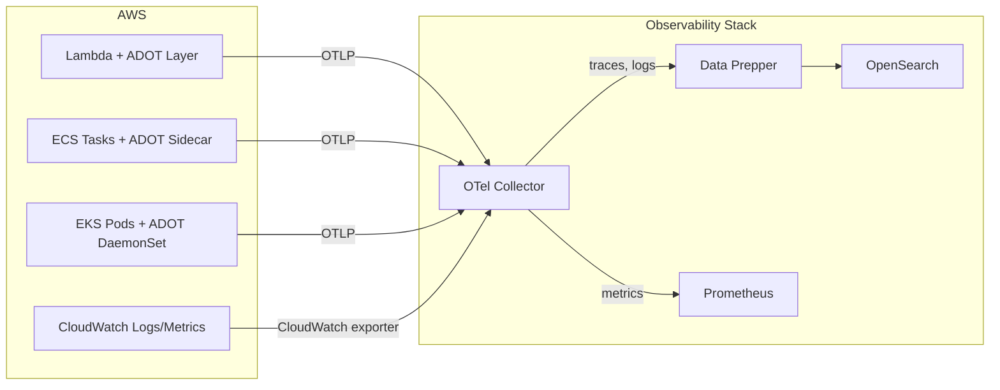

AWS environments can send telemetry to the OpenSearch Observability Stack using the AWS Distro for OpenTelemetry (ADOT). ADOT provides AWS-tested builds of the OpenTelemetry Collector and SDK auto-instrumentation agents, optimized for AWS services like ECS, EKS, Lambda, and EC2.

## Architecture



## Prerequisites

- An AWS account with appropriate IAM permissions
- A running OpenSearch Observability Stack accessible from your AWS VPC
- AWS CLI v2 configured with valid credentials

:::tip[Upstream documentation]
For AWS-specific OTel guidance, see the [AWS Distro for OpenTelemetry documentation](https://aws-otel.github.io/docs/introduction) and the [OTel Lambda auto-instrumentation guide](https://opentelemetry.io/docs/faas/lambda-auto-instrument/).
:::

## AWS Distro for OpenTelemetry (ADOT)

ADOT is the recommended way to collect telemetry from AWS workloads. It includes:

- A custom OpenTelemetry Collector distribution with AWS-specific receivers and exporters
- SDK auto-instrumentation layers for Lambda
- ECS and EKS integration patterns

### ADOT Collector vs upstream Collector

| Feature | ADOT Collector | Upstream OTel Collector |
|---------|---------------|------------------------|
| AWS support | AWS-tested, production-validated | Community-supported |
| AWS receivers | Built-in (ECS, X-Ray, CloudWatch) | Requires contrib modules |
| Release cadence | Follows AWS release cycle | Community release cycle |
| Configuration | Compatible with standard OTel config | Standard OTel config |

Use ADOT when running on AWS managed services. Use the upstream Collector for self-managed infrastructure or multi-cloud deployments.

## ECS integration

Deploy the ADOT Collector as a sidecar container in your ECS task definition to collect telemetry from your application containers.

### Task definition with ADOT sidecar

```json
{
  "family": "my-app-with-otel",
  "networkMode": "awsvpc",
  "containerDefinitions": [
    {
      "name": "my-app",
      "image": "my-app:latest",
      "essential": true,
      "environment": [
        {
          "name": "OTEL_EXPORTER_OTLP_ENDPOINT",
          "value": "http://localhost:4318"
        },
        {
          "name": "OTEL_SERVICE_NAME",
          "value": "my-app"
        },
        {
          "name": "OTEL_RESOURCE_ATTRIBUTES",
          "value": "deployment.environment.name=production"
        }
      ],
      "portMappings": [
        { "containerPort": 8080, "protocol": "tcp" }
      ]
    },
    {
      "name": "adot-collector",
      "image": "public.ecr.aws/aws-observability/aws-otel-collector:latest",
      "essential": true,
      "command": ["--config=/etc/ecs/ecs-default-config.yaml"],
      "portMappings": [
        { "containerPort": 4317, "protocol": "tcp" },
        { "containerPort": 4318, "protocol": "tcp" }
      ],
      "environment": [
        {
          "name": "OTEL_EXPORTER_OTLP_ENDPOINT",
          "value": "https://your-otel-collector.example.com:4317"
        }
      ]
    }
  ]
}
```

### Custom ADOT Collector config for ECS

Create a configuration that forwards telemetry to your Observability Stack:

```yaml
receivers:
  otlp:
    protocols:
      grpc:
        endpoint: 0.0.0.0:4317
      http:
        endpoint: 0.0.0.0:4318
  awsecscontainermetrics:
    collection_interval: 30s

processors:
  batch:
    timeout: 5s
  resourcedetection:
    detectors: [ecs, ec2]

exporters:
  otlphttp/data-prepper:
    endpoint: https://your-data-prepper.example.com:21890
  otlphttp/prometheus:
    endpoint: https://your-prometheus.example.com:9090/api/v1/otlp

service:
  pipelines:
    traces:
      receivers: [otlp]
      processors: [resourcedetection, batch]
      exporters: [otlphttp/data-prepper]
    metrics:
      receivers: [otlp, awsecscontainermetrics]
      processors: [resourcedetection, batch]
      exporters: [otlphttp/prometheus]
    logs:
      receivers: [otlp]
      processors: [resourcedetection, batch]
      exporters: [otlphttp/data-prepper]
```

## EKS integration

For EKS, deploy the ADOT Collector as a DaemonSet using the AWS-provided Helm chart or the ADOT EKS add-on.

### Install the ADOT add-on

```bash
aws eks create-addon \
  --cluster-name my-cluster \
  --addon-name adot \
  --addon-version v0.92.1-eksbuild.1
```

### Deploy the Collector

After installing the add-on, create an `OpenTelemetryCollector` custom resource:

```yaml
apiVersion: opentelemetry.io/v1alpha1
kind: OpenTelemetryCollector
metadata:
  name: adot
  namespace: observability
spec:
  mode: daemonset
  serviceAccount: adot-collector
  config: |
    receivers:
      otlp:
        protocols:
          grpc:
            endpoint: 0.0.0.0:4317
          http:
            endpoint: 0.0.0.0:4318
    processors:
      batch:
        timeout: 5s
      k8sattributes:
        auth_type: serviceAccount
    exporters:
      otlphttp/data-prepper:
        endpoint: http://data-prepper.observability.svc:21890
      otlphttp/prometheus:
        endpoint: http://prometheus.observability.svc:9090/api/v1/otlp
    service:
      pipelines:
        traces:
          receivers: [otlp]
          processors: [k8sattributes, batch]
          exporters: [otlphttp/data-prepper]
        metrics:
          receivers: [otlp]
          processors: [k8sattributes, batch]
          exporters: [otlphttp/prometheus]
        logs:
          receivers: [otlp]
          processors: [k8sattributes, batch]
          exporters: [otlphttp/data-prepper]
```

See the [Kubernetes guide](/opensearch-agentops-website/docs/send-data/infrastructure/kubernetes/) for additional Kubernetes-specific configuration.

## Lambda instrumentation

Instrument AWS Lambda functions using the ADOT Lambda layer for automatic tracing and metrics collection.

### Add the ADOT Lambda layer

```bash
aws lambda update-function-configuration \
  --function-name my-function \
  --layers arn:aws:lambda:us-east-1:901920570463:layer:aws-otel-python-amd64-ver-1-24-0:1 \
  --environment "Variables={
    AWS_LAMBDA_EXEC_WRAPPER=/opt/otel-instrument,
    OTEL_SERVICE_NAME=my-lambda-function,
    OTEL_EXPORTER_OTLP_ENDPOINT=https://your-otel-collector.example.com:4318,
    OTEL_RESOURCE_ATTRIBUTES=deployment.environment.name=production
  }"
```

### Available ADOT Lambda layers

| Runtime | Layer ARN pattern |
|---------|-------------------|
| Python | `aws-otel-python-<arch>-ver-*` |
| Node.js | `aws-otel-nodejs-<arch>-ver-*` |
| Java | `aws-otel-java-agent-<arch>-ver-*` |
| .NET | `aws-otel-dotnet-<arch>-ver-*` |
| Collector only | `aws-otel-collector-<arch>-ver-*` |

Replace `<arch>` with `amd64` or `arm64` based on your Lambda function architecture.

### Lambda-specific configuration

For Lambda functions, the ADOT layer ships with a built-in Collector. Configure it using the `OPENTELEMETRY_COLLECTOR_CONFIG_FILE` environment variable:

```yaml
receivers:
  otlp:
    protocols:
      http:
        endpoint: 0.0.0.0:4318

exporters:
  otlphttp:
    endpoint: https://your-otel-collector.example.com:4318
    compression: gzip

service:
  pipelines:
    traces:
      receivers: [otlp]
      exporters: [otlphttp]
```

## CloudWatch integration

Forward CloudWatch Logs and metrics to your Observability Stack using the CloudWatch receiver in the OTel Collector.

### CloudWatch Logs subscription

Create a subscription filter to forward logs to a Kinesis Data Firehose, which delivers to your OTel Collector or directly to OpenSearch:

```bash
aws logs put-subscription-filter \
  --log-group-name /aws/lambda/my-function \
  --filter-name otel-forward \
  --filter-pattern "" \
  --destination-arn arn:aws:firehose:us-east-1:123456789012:deliverystream/to-opensearch
```

### CloudWatch metrics via the Collector

Add the CloudWatch receiver to your OTel Collector to scrape AWS metrics:

```yaml
receivers:
  awscloudwatch:
    region: us-east-1
    poll_interval: 5m
    metrics:
      named:
        - namespace: AWS/Lambda
          metric_name: Duration
          period: 5m
          statistics: [Average, p99]
          dimensions:
            - name: FunctionName
              value: my-function
        - namespace: AWS/ECS
          metric_name: CPUUtilization
          period: 5m
          statistics: [Average]
```

## IAM permissions

The ADOT Collector requires the following IAM policy for AWS service integration:

```json
{
  "Version": "2012-10-17",
  "Statement": [
    {
      "Effect": "Allow",
      "Action": [
        "logs:DescribeLogGroups",
        "logs:DescribeLogStreams",
        "logs:GetLogEvents",
        "logs:FilterLogEvents",
        "cloudwatch:GetMetricData",
        "cloudwatch:ListMetrics",
        "ecs:ListTasks",
        "ecs:DescribeTasks",
        "ec2:DescribeInstances",
        "xray:PutTraceSegments",
        "xray:PutTelemetryRecords"
      ],
      "Resource": "*"
    }
  ]
}
```

## Related links

- [Infrastructure Monitoring Overview](/opensearch-agentops-website/docs/send-data/infrastructure/)
- [Kubernetes](/opensearch-agentops-website/docs/send-data/infrastructure/kubernetes/)
- [Prometheus](/opensearch-agentops-website/docs/send-data/infrastructure/prometheus/)
- [AWS Distro for OpenTelemetry](https://aws-otel.github.io/docs/introduction) -- Official ADOT documentation
- [OTel Lambda auto-instrumentation](https://opentelemetry.io/docs/faas/lambda-auto-instrument/) -- Serverless instrumentation guide
