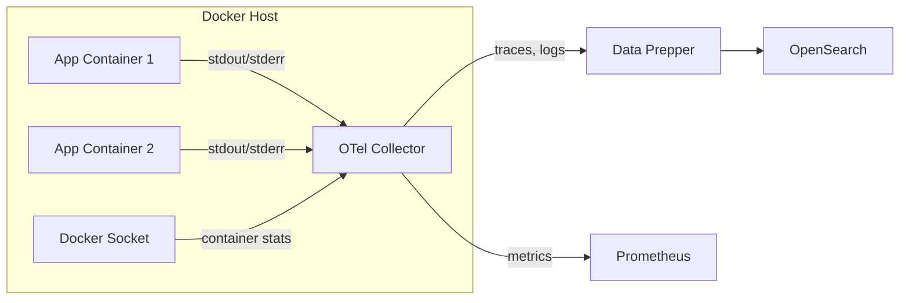

The OpenSearch Observability Stack runs as a Docker Compose project and uses the OpenTelemetry Collector to gather container metrics and logs. You can use the same approach to monitor your own Docker-based applications alongside the stack.

## Architecture



## Prerequisites

- Docker Engine 20.10 or later
- Docker Compose v2
- A running OpenSearch Observability Stack instance

:::tip[Upstream documentation]
For more on running the OTel Collector in Docker, see the [OTel Collector Docker deployment guide](https://opentelemetry.io/docs/collector/deployment/docker/).
:::

## Stack service reference

The Observability Stack runs the following core services:

| Service | Port | Description |
|---------|------|-------------|
| `opensearch` | 9200 | Search and analytics engine |
| `opensearch-dashboards` | 5601 | Visualization and dashboards UI |
| `otel-collector` | 4317, 4318, 8888 | OpenTelemetry Collector (gRPC, HTTP, metrics) |
| `data-prepper` | 21890 | Trace and log ingestion pipeline |
| `prometheus` | 9090 | Metrics scraping and storage |

## Collect container metrics

The OTel Collector uses the Docker Stats receiver to collect container-level metrics from the Docker daemon.

### Configure the Docker Stats receiver

Add the following to your OTel Collector configuration:

```yaml
receivers:
  docker_stats:
    endpoint: unix:///var/run/docker.sock
    collection_interval: 10s
    timeout: 20s
    api_version: 1.24
    metrics:
      container.cpu.usage.total:
        enabled: true
      container.memory.usage.total:
        enabled: true
      container.memory.usage.limit:
        enabled: true
      container.network.io.usage.rx_bytes:
        enabled: true
      container.network.io.usage.tx_bytes:
        enabled: true
      container.blockio.io_service_bytes_recursive.read:
        enabled: true
      container.blockio.io_service_bytes_recursive.write:
        enabled: true
```

### Mount the Docker socket

In your `docker-compose.yml`, mount the Docker socket into the OTel Collector container:

```yaml
services:
  otel-collector:
    image: otel/opentelemetry-collector-contrib:latest
    volumes:
      - /var/run/docker.sock:/var/run/docker.sock:ro
      - ./otel-collector-config.yaml:/etc/otelcol-contrib/config.yaml
    ports:
      - "4317:4317"
      - "4318:4318"
      - "8888:8888"
```

### Exported metrics

The Docker Stats receiver exports the following key metrics:

| Metric | Type | Description |
|--------|------|-------------|
| `container.cpu.usage.total` | cumulative | Total CPU time consumed |
| `container.cpu.percent` | gauge | CPU usage percentage |
| `container.memory.usage.total` | gauge | Current memory usage in bytes |
| `container.memory.usage.limit` | gauge | Memory limit in bytes |
| `container.memory.percent` | gauge | Memory usage percentage |
| `container.network.io.usage.rx_bytes` | cumulative | Bytes received |
| `container.network.io.usage.tx_bytes` | cumulative | Bytes transmitted |
| `container.blockio.io_service_bytes_recursive.read` | cumulative | Bytes read from disk |
| `container.blockio.io_service_bytes_recursive.write` | cumulative | Bytes written to disk |

## Collect container logs

### Configure the Filelog receiver

Use the Filelog receiver to tail container log files from the Docker log directory:

```yaml
receivers:
  filelog/docker:
    include:
      - /var/lib/docker/containers/*/*.log
    include_file_path: true
    operators:
      - type: json_parser
        id: docker_parser
        timestamp:
          parse_from: attributes.time
          layout: '%Y-%m-%dT%H:%M:%S.%LZ'
      - type: move
        from: attributes.log
        to: body
      - type: move
        from: attributes.stream
        to: attributes["log.iostream"]
```

Mount the Docker log directory into the collector:

```yaml
services:
  otel-collector:
    volumes:
      - /var/lib/docker/containers:/var/lib/docker/containers:ro
```

## Add your application to the stack

To monitor your own application alongside the Observability Stack, add it to the same Docker Compose file or use a shared network:

```yaml
services:
  my-app:
    image: my-app:latest
    environment:
      OTEL_EXPORTER_OTLP_ENDPOINT: http://otel-collector:4318
      OTEL_SERVICE_NAME: my-app
      OTEL_RESOURCE_ATTRIBUTES: deployment.environment.name=development
    networks:
      - observability

networks:
  observability:
    external: true
```

If your application runs in a separate Compose file, create an external network and connect both projects:

```bash
# Create a shared network
docker network create observability

# Start the Observability Stack
docker compose -f observability-stack/docker-compose.yml up -d

# Start your application
docker compose -f my-app/docker-compose.yml up -d
```

## Full collector pipeline configuration

A complete OTel Collector config that collects Docker metrics and logs, then routes them to the appropriate backends:

```yaml
receivers:
  otlp:
    protocols:
      grpc:
        endpoint: 0.0.0.0:4317
      http:
        endpoint: 0.0.0.0:4318
  docker_stats:
    endpoint: unix:///var/run/docker.sock
    collection_interval: 10s
  filelog/docker:
    include:
      - /var/lib/docker/containers/*/*.log
    operators:
      - type: json_parser
        timestamp:
          parse_from: attributes.time
          layout: '%Y-%m-%dT%H:%M:%S.%LZ'

processors:
  batch:
    timeout: 5s
    send_batch_size: 1024
  resourcedetection:
    detectors: [docker]
    timeout: 5s

exporters:
  otlphttp/data-prepper:
    endpoint: http://data-prepper:21890
  otlphttp/prometheus:
    endpoint: http://prometheus:9090/api/v1/otlp

service:
  pipelines:
    traces:
      receivers: [otlp]
      processors: [batch, resourcedetection]
      exporters: [otlphttp/data-prepper]
    metrics:
      receivers: [otlp, docker_stats]
      processors: [batch, resourcedetection]
      exporters: [otlphttp/prometheus]
    logs:
      receivers: [otlp, filelog/docker]
      processors: [batch, resourcedetection]
      exporters: [otlphttp/data-prepper]
```

## Verify data collection

1. Check that the OTel Collector is receiving Docker stats:

```bash
curl -s http://localhost:8888/metrics | grep container_cpu
```

2. Verify metrics in Prometheus:

```bash
curl -s http://localhost:9090/api/v1/query?query=container_memory_usage_total | jq .
```

3. Check logs in OpenSearch Dashboards at `http://localhost:5601`.

## Related links

- [Infrastructure Monitoring Overview](/opensearch-agentops-website/docs/send-data/infrastructure/)
- [Prometheus](/opensearch-agentops-website/docs/send-data/infrastructure/prometheus/)
- [Kubernetes](/opensearch-agentops-website/docs/send-data/infrastructure/kubernetes/)
- [OTel Collector Docker deployment](https://opentelemetry.io/docs/collector/deployment/docker/) -- Official Docker deployment guide
- [Docker Stats receiver reference](https://github.com/open-telemetry/opentelemetry-collector-contrib/tree/main/receiver/dockerstatsreceiver) -- Docker Stats receiver documentation
