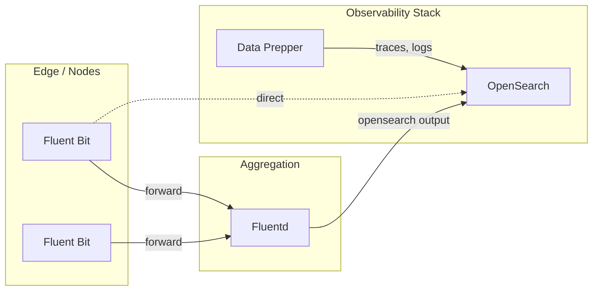

Fluentd and Fluent Bit are open-source log forwarders that collect, process, and route log data. Fluent Bit is the lightweight alternative designed for high-throughput, resource-constrained environments like containers and edge devices. Both support the OpenSearch output plugin for direct ingestion.

## Fluent Bit vs Fluentd

| Feature | Fluent Bit | Fluentd |
|---------|-----------|---------|
| Language | C | Ruby + C |
| Memory footprint | ~1 MB | ~30-40 MB |
| Plugin ecosystem | ~100 built-in plugins | 1000+ community plugins |
| Configuration | YAML or classic format | Ruby-like DSL |
| Best for | Containers, edge, DaemonSets | Aggregation, complex routing |
| OpenSearch output | Built-in | Plugin (`fluent-plugin-opensearch`) |

**Recommendation**: Use Fluent Bit for log collection at the edge or as a DaemonSet in Kubernetes. Use Fluentd as a centralized log aggregator when you need advanced routing or plugins not available in Fluent Bit.

## Architecture



## Prerequisites

- Fluent Bit 3.x or Fluentd 1.x
- Network access to OpenSearch on port 9200
- For Kubernetes: `kubectl` and Helm 3

:::tip[Upstream documentation]
For comprehensive Fluent Bit and Fluentd documentation, see the [Fluent Bit manual](https://docs.fluentbit.io/manual) and the [Fluentd documentation](https://docs.fluentd.org).
:::

## Fluent Bit

### Install Fluent Bit

#### Docker

```yaml
services:
  fluent-bit:
    image: fluent/fluent-bit:latest
    volumes:
      - ./fluent-bit.yaml:/fluent-bit/etc/fluent-bit.yaml
      - /var/log:/var/log:ro
      - /var/lib/docker/containers:/var/lib/docker/containers:ro
    ports:
      - "2020:2020"   # Monitoring
      - "24224:24224"  # Forward input
```

#### Kubernetes DaemonSet (Helm)

```bash
helm repo add fluent https://fluent.github.io/helm-charts
helm repo update

helm install fluent-bit fluent/fluent-bit \
  -n observability \
  --create-namespace \
  -f fluent-bit-values.yaml
```

### Fluent Bit configuration

Configure Fluent Bit to collect container logs and forward them to OpenSearch:

```yaml
service:
  flush: 5
  daemon: off
  log_level: info
  http_server: on
  http_listen: 0.0.0.0
  http_port: 2020

pipeline:
  inputs:
    - name: tail
      tag: kube.*
      path: /var/log/containers/*.log
      parser: cri
      mem_buf_limit: 5MB
      skip_long_lines: on
      refresh_interval: 10

    - name: systemd
      tag: host.systemd
      systemd_filter: _SYSTEMD_UNIT=kubelet.service

  filters:
    - name: kubernetes
      match: kube.*
      merge_log: on
      keep_log: off
      k8s-logging.parser: on
      k8s-logging.exclude: on

    - name: modify
      match: "*"
      add:
        cluster_name: my-cluster
        environment: production

  outputs:
    - name: opensearch
      match: "*"
      host: opensearch
      port: 9200
      index: fluent-bit-logs
      type: _doc
      http_user: admin
      http_passwd: admin
      tls: on
      tls.verify: off
      suppress_type_name: on
      trace_error: on
      replace_dots: on
      logstash_format: on
      logstash_prefix: fluent-bit
      retry_limit: 5
```

### Fluent Bit with Data Prepper

Instead of writing directly to OpenSearch, you can forward logs to Data Prepper for unified processing with OTel data:

```yaml
pipeline:
  outputs:
    - name: http
      match: "*"
      host: data-prepper
      port: 21890
      uri: /log/ingest
      format: json
      json_date_format: iso8601
```

### Kubernetes-specific Helm values

```yaml
# fluent-bit-values.yaml
config:
  service: |
    [SERVICE]
        Flush         5
        Log_Level     info
        HTTP_Server   On
        HTTP_Listen   0.0.0.0
        HTTP_Port     2020

  inputs: |
    [INPUT]
        Name              tail
        Tag               kube.*
        Path              /var/log/containers/*.log
        Parser            cri
        Mem_Buf_Limit     5MB
        Skip_Long_Lines   On

  filters: |
    [FILTER]
        Name                kubernetes
        Match               kube.*
        Merge_Log           On
        Keep_Log            Off
        K8S-Logging.Parser  On
        K8S-Logging.Exclude On

  outputs: |
    [OUTPUT]
        Name            opensearch
        Match           *
        Host            opensearch.observability.svc
        Port            9200
        Index           fluent-bit-logs
        HTTP_User       admin
        HTTP_Passwd     admin
        tls             On
        tls.verify      Off
        Suppress_Type_Name On
        Logstash_Format On
        Logstash_Prefix k8s-logs
        Retry_Limit     5

tolerations:
  - operator: Exists

resources:
  limits:
    cpu: 200m
    memory: 128Mi
  requests:
    cpu: 100m
    memory: 64Mi
```

## Fluentd

### Install Fluentd

#### Docker

```yaml
services:
  fluentd:
    image: fluent/fluentd:v1.16-1
    volumes:
      - ./fluentd/conf:/fluentd/etc
      - /var/log:/var/log:ro
    ports:
      - "24224:24224"
      - "24224:24224/udp"
```

#### Install the OpenSearch plugin

```bash
fluent-gem install fluent-plugin-opensearch
```

### Fluentd configuration

```xml
# fluentd/conf/fluent.conf

# Receive logs from Fluent Bit or Docker log driver
<source>
  @type forward
  port 24224
  bind 0.0.0.0
</source>

# Receive logs from files
<source>
  @type tail
  path /var/log/app/*.log
  pos_file /fluentd/log/app.log.pos
  tag app.logs
  <parse>
    @type json
    time_key timestamp
    time_format %Y-%m-%dT%H:%M:%S.%NZ
  </parse>
</source>

# Parse and enrich
<filter app.**>
  @type record_transformer
  <record>
    hostname "#{Socket.gethostname}"
    environment production
  </record>
</filter>

# Output to OpenSearch
<match **>
  @type opensearch
  host opensearch
  port 9200
  user admin
  password admin
  scheme https
  ssl_verify false
  index_name fluentd-logs
  logstash_format true
  logstash_prefix fluentd
  type_name _doc
  include_tag_key true
  <buffer>
    @type file
    path /fluentd/log/buffer
    flush_interval 10s
    chunk_limit_size 8m
    total_limit_size 512m
    retry_max_interval 30
    retry_forever true
  </buffer>
</match>
```

### Multi-output routing

Route different log streams to different indices:

```xml
<match app.access.**>
  @type opensearch
  host opensearch
  port 9200
  index_name access-logs
  logstash_format true
  logstash_prefix access
  # ... connection settings
</match>

<match app.error.**>
  @type opensearch
  host opensearch
  port 9200
  index_name error-logs
  logstash_format true
  logstash_prefix errors
  # ... connection settings
</match>

<match **>
  @type opensearch
  host opensearch
  port 9200
  index_name misc-logs
  logstash_format true
  logstash_prefix misc
  # ... connection settings
</match>
```

## When to use Fluent Bit vs Data Prepper

| Consideration | Fluent Bit | Data Prepper |
|---------------|-----------|--------------|
| Primary protocol | File tailing, forward, syslog | OTLP, HTTP |
| OTel integration | Limited (OTel output plugin) | Native OTLP support |
| Trace processing | Not supported | Built-in trace analytics |
| Log collection | Purpose-built for log collection | Supports logs via OTLP |
| Resource usage | Very low (~1 MB) | Moderate (JVM-based) |
| Kubernetes | Mature DaemonSet pattern | Sidecar or Deployment |
| Best for | High-volume log forwarding | OTel-native pipelines |

**Recommendation**: Use Fluent Bit when you need lightweight, high-throughput log collection, especially in Kubernetes or resource-constrained environments. Use Data Prepper when your applications emit telemetry via OpenTelemetry and you want unified trace and log processing. You can also use both together -- Fluent Bit collects logs and forwards them to Data Prepper for unified processing.

## Verify log ingestion

Check that logs are reaching OpenSearch:

```bash
# Count documents in the log index
curl -s -u admin:admin -k \
  'https://opensearch:9200/fluent-bit-*/_count' | jq .

# View recent logs
curl -s -u admin:admin -k \
  'https://opensearch:9200/fluent-bit-*/_search?size=5&sort=@timestamp:desc' | jq '.hits.hits[]._source'
```

Check Fluent Bit health:

```bash
curl -s http://localhost:2020/api/v1/health
curl -s http://localhost:2020/api/v1/metrics | jq .
```

## Related links

- [Infrastructure Monitoring Overview](/opensearch-agentops-website/docs/send-data/infrastructure/)
- [Logstash](/opensearch-agentops-website/docs/send-data/infrastructure/logstash/)
- [Docker](/opensearch-agentops-website/docs/send-data/infrastructure/docker/)
- [Kubernetes](/opensearch-agentops-website/docs/send-data/infrastructure/kubernetes/)
- [Fluent Bit documentation](https://docs.fluentbit.io/manual) -- Official Fluent Bit manual
- [Fluentd documentation](https://docs.fluentd.org) -- Official Fluentd reference
