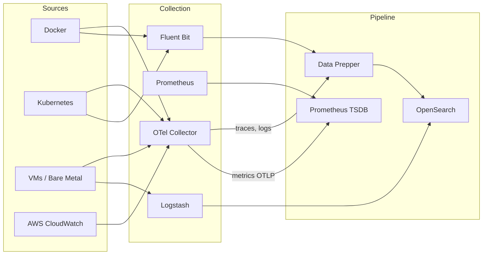

Infrastructure monitoring gives you visibility into the health and performance of the systems that run your applications. The OpenSearch Observability Stack uses OpenTelemetry as the primary collection mechanism, with support for additional tools like Prometheus, Logstash, and Fluent Bit for specialized use cases.

## Architecture overview

The following diagram shows how infrastructure telemetry flows through the stack:

## Collection strategies

Choose your collection approach based on what you need to monitor:

| Strategy | Best for | Telemetry types | Tool |
|----------|----------|-----------------|------|
| OTel Collector receivers | Container and host metrics, logs | Metrics, logs | OpenTelemetry Collector |
| Prometheus scraping | Application and service metrics | Metrics | Prometheus |
| Log forwarders | High-volume log collection | Logs | Fluent Bit, Fluentd, Logstash |
| Cloud integrations | Managed cloud services | Metrics, logs, traces | ADOT, CloudWatch |

### OpenTelemetry-first approach

The recommended approach is to deploy the OpenTelemetry Collector as your primary collection agent. The Collector provides:

- **Unified collection** of metrics, logs, and traces from a single agent
- **Receivers** for Docker stats, Kubernetes cluster metrics, host metrics, and more
- **Processors** for enriching data with resource attributes (hostname, container ID, pod name)
- **Exporters** to route data to Data Prepper (traces/logs) and Prometheus (metrics)

### Supplementary tools

For specific use cases, you can add specialized tools alongside the OTel Collector:

- **Prometheus** for scraping metrics endpoints and long-term metric storage
- **Fluent Bit** for lightweight, high-throughput log forwarding
- **Logstash** for complex log transformation pipelines
- **ADOT** for AWS-native environments with managed collector support

## Core infrastructure signals

### Metrics

Infrastructure metrics provide quantitative measurements of system health:

- **Host metrics**: CPU usage, memory utilization, disk I/O, network throughput
- **Container metrics**: Container CPU/memory limits and usage, restart counts, network stats
- **Kubernetes metrics**: Pod status, node capacity, deployment replicas, resource requests vs limits
- **Service metrics**: Prometheus-scraped application metrics, custom gauges and counters

### Logs

Infrastructure logs capture events and state changes:

- **Container logs**: stdout/stderr from running containers
- **System logs**: Syslog, journald, kernel messages
- **Kubernetes logs**: Pod logs, kubelet logs, control plane component logs
- **Cloud service logs**: CloudWatch Logs, ECS task logs, Lambda invocation logs

### Traces

Infrastructure traces are less common but useful for:

- **Request routing**: Tracing requests through load balancers and proxies
- **Service mesh**: Envoy/Istio sidecar proxy traces
- **Cloud function invocations**: Lambda execution traces via ADOT

## Prerequisites

Before setting up infrastructure monitoring, ensure you have:

- A running OpenSearch Observability Stack (see [Sandbox](/opensearch-agentops-website/docs/get-started/sandbox/))
- Network access from your infrastructure to the OTel Collector endpoints (ports 4317/4318)
- Appropriate permissions to deploy agents on your target infrastructure

## Next steps

Choose the guide that matches your infrastructure:

- [Docker](/opensearch-agentops-website/docs/send-data/infrastructure/docker/) -- Monitor Docker containers and Compose deployments
- [Kubernetes](/opensearch-agentops-website/docs/send-data/infrastructure/kubernetes/) -- Monitor Kubernetes clusters, pods, and workloads
- [AWS](/opensearch-agentops-website/docs/send-data/infrastructure/aws/) -- Integrate with AWS services using ADOT
- [Prometheus](/opensearch-agentops-website/docs/send-data/infrastructure/prometheus/) -- Scrape and store Prometheus metrics
- [Logstash](/opensearch-agentops-website/docs/send-data/infrastructure/logstash/) -- Route logs through Logstash pipelines
- [Fluentd & Fluent Bit](/opensearch-agentops-website/docs/send-data/infrastructure/fluentd/) -- Forward logs with lightweight agents
