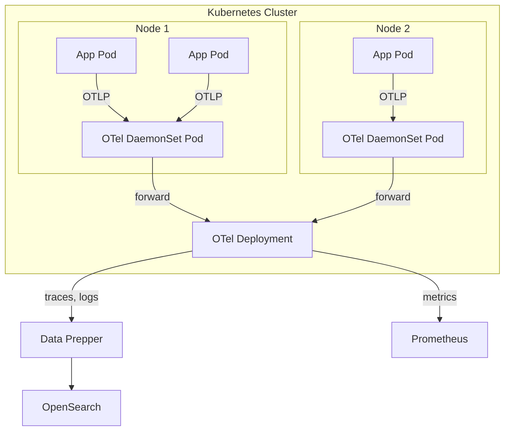

Kubernetes environments require a distributed collection strategy to capture cluster metrics, pod logs, and distributed traces across nodes. The OpenTelemetry Collector deployed as a DaemonSet and/or Deployment provides comprehensive Kubernetes observability.

## Architecture



## Prerequisites

- Kubernetes cluster (v1.24 or later)
- `kubectl` configured with cluster access
- Helm 3 installed
- Network access from the cluster to your OpenSearch Observability Stack endpoints

:::tip[Upstream documentation]
For comprehensive Kubernetes observability with OpenTelemetry, see the [OTel Kubernetes documentation](https://opentelemetry.io/docs/kubernetes/) and the [Helm chart guide](https://opentelemetry.io/docs/kubernetes/helm/).
:::

## Deployment patterns

| Pattern | Use case | Collector mode |
|---------|----------|----------------|
| DaemonSet | Node-level metrics and pod log collection | Agent |
| Deployment | Cluster-wide metrics, centralized processing | Gateway |
| Sidecar | Per-pod collection with custom processing | Agent |

The recommended approach combines a DaemonSet for per-node collection with a Deployment for centralized processing and export.

## Install with Helm

The OpenTelemetry Operator and Collector Helm charts simplify deployment on Kubernetes.

### Add the Helm repository

```bash
helm repo add open-telemetry https://open-telemetry.github.io/opentelemetry-helm-charts
helm repo update
```

### Deploy the Collector as a DaemonSet

Create a `values-daemonset.yaml` file:

```yaml
mode: daemonset

presets:
  logsCollection:
    enabled: true
    includeCollectorLogs: false
  hostMetrics:
    enabled: true
  kubernetesAttributes:
    enabled: true
    extractAllPodLabels: true
    extractAllPodAnnotations: false

config:
  receivers:
    kubeletstats:
      collection_interval: 30s
      auth_type: serviceAccount
      endpoint: "https://${env:K8S_NODE_NAME}:10250"
      insecure_skip_verify: true
      metric_groups:
        - node
        - pod
        - container

  processors:
    batch:
      timeout: 5s
      send_batch_size: 1024
    k8sattributes:
      auth_type: serviceAccount
      extract:
        metadata:
          - k8s.namespace.name
          - k8s.deployment.name
          - k8s.statefulset.name
          - k8s.daemonset.name
          - k8s.job.name
          - k8s.cronjob.name
          - k8s.node.name
          - k8s.pod.name
          - k8s.pod.uid
          - k8s.pod.start_time
        labels:
          - tag_name: app.label.component
            key: app.kubernetes.io/component
            from: pod
      pod_association:
        - sources:
            - from: resource_attribute
              name: k8s.pod.ip

  exporters:
    otlphttp/data-prepper:
      endpoint: http://data-prepper.observability.svc:21890
    otlphttp/prometheus:
      endpoint: http://prometheus.observability.svc:9090/api/v1/otlp

  service:
    pipelines:
      traces:
        receivers: [otlp]
        processors: [k8sattributes, batch]
        exporters: [otlphttp/data-prepper]
      metrics:
        receivers: [otlp, hostmetrics, kubeletstats]
        processors: [k8sattributes, batch]
        exporters: [otlphttp/prometheus]
      logs:
        receivers: [otlp, filelog]
        processors: [k8sattributes, batch]
        exporters: [otlphttp/data-prepper]
```

Install the chart:

```bash
helm install otel-daemonset open-telemetry/opentelemetry-collector \
  -f values-daemonset.yaml \
  -n observability \
  --create-namespace
```

### Deploy the Collector as a Deployment (gateway)

For cluster-level metrics, deploy a separate Collector as a Deployment:

```yaml
mode: deployment
replicaCount: 2

config:
  receivers:
    k8s_cluster:
      collection_interval: 30s
      node_conditions_to_report:
        - Ready
        - MemoryPressure
        - DiskPressure
      allocatable_types_to_report:
        - cpu
        - memory
        - storage
    k8s_events:
      auth_type: serviceAccount

  processors:
    batch:
      timeout: 5s

  exporters:
    otlphttp/data-prepper:
      endpoint: http://data-prepper.observability.svc:21890
    otlphttp/prometheus:
      endpoint: http://prometheus.observability.svc:9090/api/v1/otlp

  service:
    pipelines:
      metrics:
        receivers: [k8s_cluster]
        processors: [batch]
        exporters: [otlphttp/prometheus]
      logs:
        receivers: [k8s_events]
        processors: [batch]
        exporters: [otlphttp/data-prepper]
```

```bash
helm install otel-gateway open-telemetry/opentelemetry-collector \
  -f values-deployment.yaml \
  -n observability
```

## Kubernetes attributes processor

The `k8sattributes` processor enriches telemetry with Kubernetes metadata. This is critical for correlating metrics, logs, and traces with their source pods and deployments.

### Extracted attributes

| Attribute | Description |
|-----------|-------------|
| `k8s.namespace.name` | Namespace of the pod |
| `k8s.pod.name` | Pod name |
| `k8s.pod.uid` | Pod UID |
| `k8s.node.name` | Node the pod runs on |
| `k8s.deployment.name` | Owning Deployment name |
| `k8s.statefulset.name` | Owning StatefulSet name |
| `k8s.daemonset.name` | Owning DaemonSet name |
| `k8s.container.name` | Container name within the pod |
| `k8s.container.restart_count` | Container restart count |

### RBAC requirements

The Collector service account needs permissions to query the Kubernetes API. The Helm chart creates these automatically, but if deploying manually, apply:

```yaml
apiVersion: rbac.authorization.k8s.io/v1
kind: ClusterRole
metadata:
  name: otel-collector
rules:
  - apiGroups: [""]
    resources: ["pods", "namespaces", "nodes", "nodes/stats", "events"]
    verbs: ["get", "list", "watch"]
  - apiGroups: ["apps"]
    resources: ["deployments", "replicasets", "statefulsets", "daemonsets"]
    verbs: ["get", "list", "watch"]
  - apiGroups: ["batch"]
    resources: ["jobs", "cronjobs"]
    verbs: ["get", "list", "watch"]
---
apiVersion: rbac.authorization.k8s.io/v1
kind: ClusterRoleBinding
metadata:
  name: otel-collector
roleRef:
  apiGroup: rbac.authorization.k8s.io
  kind: ClusterRole
  name: otel-collector
subjects:
  - kind: ServiceAccount
    name: otel-collector
    namespace: observability
```

## Collect pod logs

The DaemonSet preset `logsCollection.enabled: true` configures the Filelog receiver to tail pod logs from `/var/log/pods/`. The receiver automatically parses the CRI log format and extracts metadata.

To filter logs for specific namespaces:

```yaml
config:
  receivers:
    filelog:
      include:
        - /var/log/pods/my-namespace_*/*/*.log
      exclude:
        - /var/log/pods/kube-system_*/*/*.log
```

## Configure application instrumentation

Applications running in Kubernetes send telemetry to the DaemonSet Collector via the node-local OTLP endpoint. Set these environment variables in your application pods:

```yaml
env:
  - name: K8S_NODE_NAME
    valueFrom:
      fieldRef:
        fieldPath: spec.nodeName
  - name: OTEL_EXPORTER_OTLP_ENDPOINT
    value: "http://$(K8S_NODE_NAME):4317"
  - name: OTEL_SERVICE_NAME
    value: "my-service"
  - name: OTEL_RESOURCE_ATTRIBUTES
    value: "k8s.namespace.name=$(K8S_NAMESPACE),k8s.pod.name=$(K8S_POD_NAME)"
  - name: K8S_NAMESPACE
    valueFrom:
      fieldRef:
        fieldPath: metadata.namespace
  - name: K8S_POD_NAME
    valueFrom:
      fieldRef:
        fieldPath: metadata.name
```

## Verify the deployment

Check that the Collector pods are running:

```bash
kubectl get pods -n observability -l app.kubernetes.io/name=opentelemetry-collector
```

View Collector logs for errors:

```bash
kubectl logs -n observability -l app.kubernetes.io/name=opentelemetry-collector --tail=50
```

Verify metrics are being collected in Prometheus:

```bash
kubectl port-forward -n observability svc/prometheus 9090:9090
curl -s 'http://localhost:9090/api/v1/query?query=k8s_pod_cpu_utilization' | jq .
```

## Related links

- [Infrastructure Monitoring Overview](/opensearch-agentops-website/docs/send-data/infrastructure/)
- [Docker](/opensearch-agentops-website/docs/send-data/infrastructure/docker/)
- [Prometheus](/opensearch-agentops-website/docs/send-data/infrastructure/prometheus/)
- [OpenTelemetry Kubernetes documentation](https://opentelemetry.io/docs/kubernetes/) -- Official OTel Kubernetes guide
- [OTel Collector Helm charts](https://opentelemetry.io/docs/kubernetes/helm/) -- Helm deployment reference
