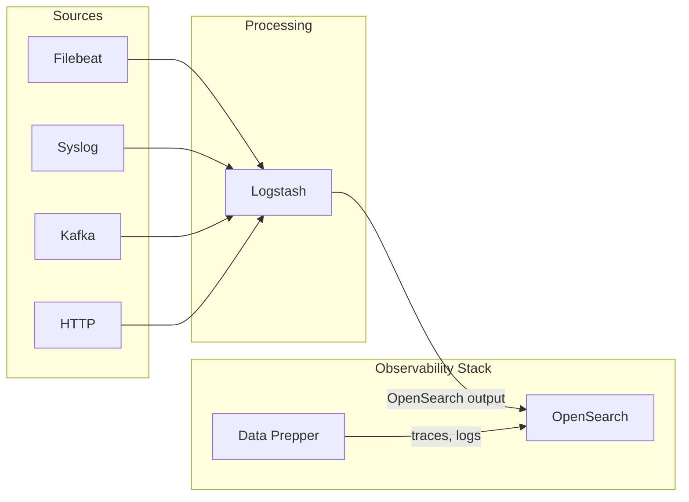

Logstash is a server-side data processing pipeline that ingests, transforms, and forwards logs and events. When used with the OpenSearch Observability Stack, Logstash can serve as an alternative or complement to Data Prepper for log ingestion, particularly when you need complex transformations, conditional routing, or have existing Logstash pipelines.

## Architecture



## Prerequisites

- Java 11 or later (Java 17 recommended)
- Logstash 8.x with the OpenSearch output plugin
- Network access to OpenSearch on port 9200

:::tip[Upstream documentation]
For more on the OpenSearch Logstash plugin, see the [OpenSearch Logstash documentation](https://opensearch.org/docs/latest/tools/logstash/index/).
:::

## Install Logstash with OpenSearch output

### Install Logstash

```bash
# Download and install Logstash
wget https://artifacts.opensearch.org/logstash/logstash-oss-with-opensearch-output-plugin-8.9.0-linux-x64.tar.gz
tar -xzf logstash-oss-with-opensearch-output-plugin-8.9.0-linux-x64.tar.gz
cd logstash-8.9.0
```

Or install the plugin into an existing Logstash installation:

```bash
bin/logstash-plugin install logstash-output-opensearch
```

### Docker deployment

```yaml
services:
  logstash:
    image: opensearchproject/logstash-oss-with-opensearch-output-plugin:8.9.0
    volumes:
      - ./pipeline:/usr/share/logstash/pipeline
      - ./config/logstash.yml:/usr/share/logstash/config/logstash.yml
    ports:
      - "5044:5044"    # Beats input
      - "5000:5000"    # TCP input
      - "9600:9600"    # Monitoring API
    environment:
      LS_JAVA_OPTS: "-Xmx512m -Xms512m"
```

## Pipeline configuration

Logstash pipelines consist of three stages: input, filter, and output.

### Basic log pipeline

```ruby
input {
  beats {
    port => 5044
  }
  tcp {
    port => 5000
    codec => json_lines
  }
}

filter {
  # Parse JSON log bodies
  if [message] =~ /^\{/ {
    json {
      source => "message"
      target => "parsed"
    }
  }

  # Add timestamp
  date {
    match => ["[parsed][timestamp]", "ISO8601", "yyyy-MM-dd HH:mm:ss"]
    target => "@timestamp"
  }

  # Add environment metadata
  mutate {
    add_field => {
      "environment" => "production"
      "pipeline" => "logstash"
    }
  }
}

output {
  opensearch {
    hosts => ["https://opensearch:9200"]
    index => "logs-%{+YYYY.MM.dd}"
    user => "admin"
    password => "admin"
    ssl_certificate_verification => false
  }
}
```

### Syslog ingestion

```ruby
input {
  syslog {
    port => 1514
    type => "syslog"
  }
}

filter {
  if [type] == "syslog" {
    grok {
      match => {
        "message" => "%{SYSLOGTIMESTAMP:syslog_timestamp} %{SYSLOGHOST:hostname} %{DATA:program}(?:\[%{POSINT:pid}\])?: %{GREEDYDATA:log_message}"
      }
    }
    date {
      match => ["syslog_timestamp", "MMM  d HH:mm:ss", "MMM dd HH:mm:ss"]
    }
    mutate {
      remove_field => ["message"]
      rename => { "log_message" => "message" }
    }
  }
}

output {
  opensearch {
    hosts => ["https://opensearch:9200"]
    index => "syslog-%{+YYYY.MM.dd}"
    user => "admin"
    password => "admin"
    ssl_certificate_verification => false
  }
}
```

### Conditional routing

Route different log types to different indices:

```ruby
filter {
  if [fields][log_type] == "application" {
    mutate { add_field => { "[@metadata][target_index]" => "app-logs" } }
  } else if [fields][log_type] == "access" {
    mutate { add_field => { "[@metadata][target_index]" => "access-logs" } }
  } else {
    mutate { add_field => { "[@metadata][target_index]" => "misc-logs" } }
  }
}

output {
  opensearch {
    hosts => ["https://opensearch:9200"]
    index => "%{[@metadata][target_index]}-%{+YYYY.MM.dd}"
    user => "admin"
    password => "admin"
    ssl_certificate_verification => false
  }
}
```

## OpenSearch output plugin reference

| Parameter | Default | Description |
|-----------|---------|-------------|
| `hosts` | -- | Array of OpenSearch endpoints |
| `index` | `logstash-%{+YYYY.MM.dd}` | Index name pattern |
| `user` | -- | Basic auth username |
| `password` | -- | Basic auth password |
| `ssl_certificate_verification` | `true` | Verify SSL certificates |
| `template_name` | `logstash` | Index template name |
| `bulk_size` | `500` | Number of events per bulk request |
| `retry_max_interval` | `64` | Max seconds between retries |
| `pipeline` | -- | Ingest pipeline to apply |

## When to use Logstash vs Data Prepper

| Consideration | Logstash | Data Prepper |
|---------------|----------|--------------|
| Primary protocol | Beats, TCP, Syslog | OTLP, HTTP |
| Transform language | Ruby-based filter DSL | YAML pipeline config |
| Plugin ecosystem | 200+ plugins (inputs, filters, outputs) | Focused on OTel and OpenSearch |
| OTel integration | Limited (requires plugins) | Native OTLP support |
| Trace processing | Not designed for traces | Built-in trace analytics |
| Resource usage | Higher (JVM-based, full pipeline) | Moderate (JVM-based, focused) |
| Best for | Complex log transformations, legacy systems | OTel-native pipelines, trace/log correlation |

**Recommendation**: Use Data Prepper when your telemetry sources support OpenTelemetry. Use Logstash when you need to ingest from non-OTel sources (syslog, Beats, Kafka), require complex log transformations with Grok patterns, or have existing Logstash pipelines you want to keep.

## Monitoring Logstash

Logstash exposes a monitoring API on port 9600:

```bash
# Pipeline stats
curl -s http://localhost:9600/_node/stats/pipelines | jq .

# Check if Logstash is running
curl -s http://localhost:9600/ | jq '.status'

# Event processing rate
curl -s http://localhost:9600/_node/stats/pipelines | jq '.pipelines.main.events'
```

## Related links

- [Infrastructure Monitoring Overview](/opensearch-agentops-website/docs/send-data/infrastructure/)
- [Fluentd & Fluent Bit](/opensearch-agentops-website/docs/send-data/infrastructure/fluentd/)
- [Docker](/opensearch-agentops-website/docs/send-data/infrastructure/docker/)
- [OpenSearch Logstash documentation](https://opensearch.org/docs/latest/tools/logstash/index/) -- Official OpenSearch Logstash plugin reference
