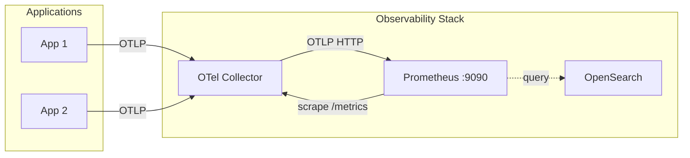

Prometheus serves as the metrics backend in the OpenSearch Observability Stack. It receives metrics from the OpenTelemetry Collector via the OTLP endpoint and scrapes its own targets. The stack's Prometheus configuration includes OTLP resource attribute promotion, which maps OpenTelemetry resource attributes to Prometheus labels for rich metric querying.

## Architecture



## Prerequisites

- A running OpenSearch Observability Stack
- OTel Collector configured to export metrics via OTLP HTTP
- Network access to Prometheus on port 9090

:::tip[Upstream documentation]
For Prometheus and OpenTelemetry compatibility details, see the [OTel Prometheus compatibility specification](https://opentelemetry.io/docs/specs/otel/compatibility/prometheus_and_openmetrics/) and the [Prometheus configuration reference](https://prometheus.io/docs/prometheus/latest/configuration/configuration/).
:::

## Stack Prometheus configuration

The Observability Stack ships with the following Prometheus configuration:

```yaml
global:
  scrape_interval: 60s
  scrape_timeout: 10s
  evaluation_interval: 60s
  external_labels:
    cluster: observability-stack-dev
    environment: development

otlp:
  keep_identifying_resource_attributes: true
  promote_resource_attributes:
    - service.instance.id
    - service.name
    - service.namespace
    - service.version
    - deployment.environment.name
    - gen_ai.agent.id
    - gen_ai.agent.name
    - gen_ai.provider.name
    - gen_ai.request.model
    - gen_ai.response.model

storage:
  tsdb:
    out_of_order_time_window: 30m

scrape_configs:
  - job_name: 'prometheus'
    static_configs:
      - targets: ['localhost:9090']
  - job_name: 'otel-collector'
    scrape_interval: 10s
    static_configs:
      - targets: ['otel-collector:8888']
```

### Configuration breakdown

#### Global settings

| Setting | Value | Description |
|---------|-------|-------------|
| `scrape_interval` | `60s` | Default interval between metric scrapes |
| `scrape_timeout` | `10s` | Timeout for each scrape request |
| `evaluation_interval` | `60s` | How often recording and alerting rules are evaluated |
| `external_labels.cluster` | `observability-stack-dev` | Cluster label added to all metrics |
| `external_labels.environment` | `development` | Environment label added to all metrics |

#### OTLP receiver configuration

The `otlp` section configures how Prometheus receives metrics from the OTel Collector:

- **`keep_identifying_resource_attributes: true`** -- Retains OTel resource attributes as metric labels, preserving the full identity of the metric source.
- **`promote_resource_attributes`** -- Promotes specific OpenTelemetry resource attributes to first-class Prometheus labels. This allows you to query and aggregate metrics by service name, version, environment, and AI model attributes.

**Promoted attributes:**

| Resource attribute | Use case |
|-------------------|----------|
| `service.instance.id` | Distinguish between instances of the same service |
| `service.name` | Filter metrics by service |
| `service.namespace` | Group services by namespace |
| `service.version` | Track metrics across deployments/versions |
| `deployment.environment.name` | Separate dev/staging/production metrics |
| `gen_ai.agent.id` | Filter by AI agent instance |
| `gen_ai.agent.name` | Filter by AI agent name |
| `gen_ai.provider.name` | Filter by LLM provider (OpenAI, Anthropic, etc.) |
| `gen_ai.request.model` | Filter by requested model |
| `gen_ai.response.model` | Filter by actual model used in response |

#### Storage configuration

The `out_of_order_time_window: 30m` setting allows Prometheus to accept samples that arrive up to 30 minutes out of order. This is important for OTLP ingestion because the OTel Collector may batch and send metrics with slight delays.

#### Scrape configs

The default configuration scrapes two targets:

1. **`prometheus`** -- Prometheus self-monitoring metrics at `localhost:9090`
2. **`otel-collector`** -- OTel Collector internal metrics at `otel-collector:8888`, scraped every 10 seconds for near-real-time collector health monitoring

## OTel Collector metrics export

Configure the OTel Collector to send metrics to Prometheus via the OTLP HTTP exporter:

```yaml
exporters:
  otlphttp/prometheus:
    endpoint: http://prometheus:9090/api/v1/otlp
    tls:
      insecure: true
```

The Collector sends metrics to the `/api/v1/otlp` endpoint, which Prometheus processes using its native OTLP receiver. This is the preferred method over Prometheus remote write because it preserves OpenTelemetry resource attributes.

## Add custom scrape targets

To scrape additional targets, extend the `scrape_configs` section:

```yaml
scrape_configs:
  # Existing configs...

  - job_name: 'my-application'
    scrape_interval: 30s
    static_configs:
      - targets: ['my-app:8080']
    metrics_path: /metrics

  - job_name: 'node-exporter'
    scrape_interval: 15s
    static_configs:
      - targets: ['node-exporter:9100']

  - job_name: 'kubernetes-pods'
    kubernetes_sd_configs:
      - role: pod
    relabel_configs:
      - source_labels: [__meta_kubernetes_pod_annotation_prometheus_io_scrape]
        action: keep
        regex: true
      - source_labels: [__meta_kubernetes_pod_annotation_prometheus_io_port]
        action: replace
        target_label: __address__
        regex: (.+)
        replacement: ${1}
```

## Remote write from external Prometheus

If you have an existing Prometheus instance, you can forward metrics to the stack's Prometheus using remote write:

```yaml
# In your external Prometheus config
remote_write:
  - url: http://your-stack-prometheus:9090/api/v1/write
    queue_config:
      max_samples_per_send: 5000
      batch_send_deadline: 5s
```

## Query examples

Once metrics are flowing, query them using PromQL:

```promql
# CPU usage by service
rate(process_cpu_seconds_total{service_name="my-app"}[5m])

# Request rate by AI model
rate(gen_ai_client_operation_duration_count{gen_ai_request_model="gpt-4"}[5m])

# Memory usage by environment
process_resident_memory_bytes{deployment_environment_name="production"}

# OTel Collector throughput
rate(otelcol_exporter_sent_metric_points_total[5m])
```

Note that Prometheus converts OTel resource attribute names to label names by replacing dots with underscores (e.g., `service.name` becomes `service_name`).

## When to use Prometheus vs OpenSearch for metrics

| Consideration | Prometheus | OpenSearch |
|---------------|-----------|------------|
| Query language | PromQL (optimized for time-series) | PPL, SQL, DQL |
| Retention | Typically 15-90 days | Long-term storage |
| Cardinality | Best for low-to-medium cardinality | Handles high cardinality well |
| Alerting | Built-in Alertmanager integration | OpenSearch alerting plugin |
| Dashboards | Grafana, built-in UI | OpenSearch Dashboards |
| Use case | Real-time monitoring, alerting | Historical analysis, correlation with logs/traces |

**Recommendation**: Use Prometheus for real-time metrics, alerting, and operational dashboards. Use OpenSearch for long-term metric storage, cross-signal correlation (metrics + logs + traces), and historical analysis.

## Verify metrics ingestion

1. Check that Prometheus is receiving OTLP metrics:

```bash
curl -s http://localhost:9090/api/v1/targets | jq '.data.activeTargets[] | {job: .labels.job, health: .health}'
```

2. Verify promoted resource attributes appear as labels:

```bash
curl -s 'http://localhost:9090/api/v1/label/service_name/values' | jq .
```

3. Check the OTel Collector scrape target health:

```bash
curl -s 'http://localhost:9090/api/v1/query?query=up{job="otel-collector"}' | jq '.data.result[0].value[1]'
```

## Related links

- [Infrastructure Monitoring Overview](/opensearch-agentops-website/docs/send-data/infrastructure/)
- [Docker](/opensearch-agentops-website/docs/send-data/infrastructure/docker/)
- [Kubernetes](/opensearch-agentops-website/docs/send-data/infrastructure/kubernetes/)
- [OTel Prometheus compatibility](https://opentelemetry.io/docs/specs/otel/compatibility/prometheus_and_openmetrics/) -- Prometheus and OpenMetrics compatibility spec
- [Prometheus configuration reference](https://prometheus.io/docs/prometheus/latest/configuration/configuration/) -- Official Prometheus configuration docs
