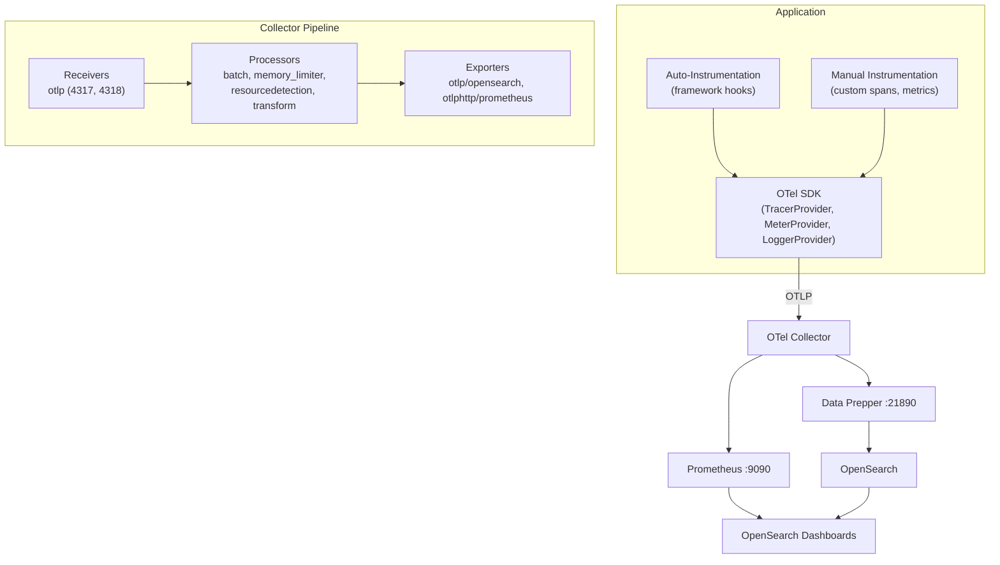

[OpenTelemetry](https://opentelemetry.io/) (OTel) is the CNCF standard for generating, collecting, and exporting telemetry data. The OpenSearch Observability Stack uses OpenTelemetry as its primary ingestion interface -- all telemetry flows through OTel SDKs and the OTel Collector before reaching storage backends.

This section covers the OTel Collector configuration, instrumentation approaches, and sampling strategies.

:::tip[Upstream documentation]
To learn more about OpenTelemetry concepts and architecture, see [What is OpenTelemetry?](https://opentelemetry.io/docs/what-is-opentelemetry/) on the official OpenTelemetry website.
:::

## Telemetry Signals

OpenTelemetry defines three core signal types:

### Traces

A **trace** represents a single request as it propagates through your system. Each trace is composed of **spans** -- units of work with a start time, duration, status, and parent-child relationships.

Traces answer questions like:
- Which services handled this request?
- Where did latency occur?
- What caused the error?

The stack stores traces in OpenSearch via Data Prepper, indexed in `otel-v1-apm-span-*` indices.

### Metrics

A **metric** is a numerical measurement captured over time. OTel supports counters, histograms, gauges, and exponential histograms.

Metrics answer questions like:
- What is the request rate for this service?
- What is the p99 latency?
- How much memory is the process using?

The stack routes metrics to Prometheus via OTLP HTTP for efficient time-series storage and querying.

### Logs

A **log** is a timestamped text or structured record emitted by an application. OTel logs support trace correlation, meaning each log record can carry a `traceId` and `spanId` to link it to the distributed trace that was active when the log was emitted.

The stack stores logs in OpenSearch via Data Prepper, enabling full-text search and trace-correlated log exploration.

## OTLP Protocol

All three signals are transmitted using the **OpenTelemetry Protocol (OTLP)**, which supports two transports:

| Transport | Endpoint | Encoding | Best For |
|-----------|----------|----------|----------|
| gRPC | `http://localhost:4317` | Protobuf | Backend services, high throughput |
| HTTP | `http://localhost:4318` | Protobuf or JSON | Browsers, serverless, restricted networks |

OTLP is the only protocol you need. Unlike vendor-specific formats (Zipkin, Jaeger, StatsD), OTLP carries all three signals over a single connection, reducing operational complexity.

## Architecture

The following diagram shows how OpenTelemetry components fit into the stack:

**Key points:**

1. **SDKs** run in your application process. They create spans, record metrics, and bridge log frameworks.
2. **Auto-instrumentation** hooks into frameworks and libraries to generate telemetry without code changes.
3. **Manual instrumentation** lets you add custom spans, attributes, and metrics for business-specific observability.
4. **The OTel Collector** receives, processes, and exports telemetry. It runs as a standalone service (not embedded in your app).
5. **Data Prepper** receives traces and logs from the Collector and writes them to OpenSearch indices.
6. **Prometheus** receives metrics from the Collector via OTLP HTTP.

## Semantic Conventions

OpenTelemetry defines [semantic conventions](https://opentelemetry.io/docs/specs/semconv/) -- standardized attribute names for common concepts. The stack relies on these conventions for its dashboards and visualizations:

| Convention | Prefix | Example Attributes |
|------------|--------|--------------------|
| HTTP | `http.*`, `url.*` | `http.request.method`, `url.path`, `http.response.status_code` |
| Database | `db.*` | `db.system.name`, `db.query.text`, `db.operation.name` |
| RPC | `rpc.*` | `rpc.system`, `rpc.service`, `rpc.method` |
| Gen-AI | `gen_ai.*` | `gen_ai.system`, `gen_ai.request.model`, `gen_ai.usage.input_tokens` |
| Service | `service.*` | `service.name`, `service.version`, `service.namespace` |

Using standard attribute names means the APM dashboards, service maps, and agent trace views work out of the box.

## In This Section

- [Collector Configuration](/opensearch-agentops-website/docs/send-data/opentelemetry/collector/) -- Full walkthrough of the OTel Collector pipeline config
- [Auto-Instrumentation](/opensearch-agentops-website/docs/send-data/opentelemetry/auto-instrumentation/) -- Zero-code instrumentation for popular languages
- [Manual Instrumentation](/opensearch-agentops-website/docs/send-data/opentelemetry/manual-instrumentation/) -- Custom spans, metrics, and logs with the OTel SDK
- [Sampling Strategies](/opensearch-agentops-website/docs/send-data/opentelemetry/sampling/) -- Control data volume with head-based and tail-based sampling

## Related Links

- [Send Data Overview](/opensearch-agentops-website/docs/send-data/) -- Full ingestion architecture
- [Agent Traces](/opensearch-agentops-website/docs/ai-observability/agent-tracing/) -- AI agent trace visualization
- [APM Services](/opensearch-agentops-website/docs/apm/services/) -- Service health monitoring
- [What is OpenTelemetry?](https://opentelemetry.io/docs/what-is-opentelemetry/) -- Official overview of the OpenTelemetry project
- [OpenTelemetry Semantic Conventions](https://opentelemetry.io/docs/specs/semconv/) -- Standard attribute naming reference
